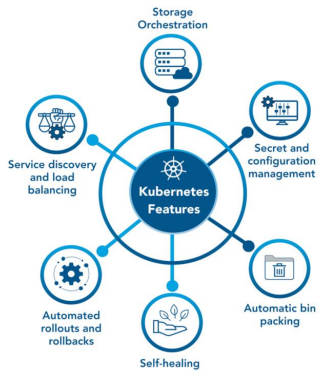
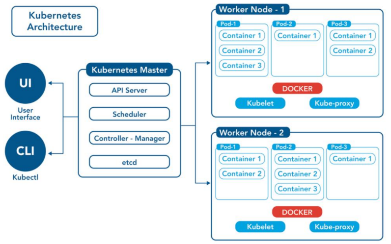

I. What is Kubernetes ?
- Kubernetes là một nền tảng orchestration (điều phối) container mã nguồn mở, do Google phát triển và donate cho CNCF năm 2014. Nó giải quyết bài toán: làm sao chạy hàng trăm/nghìn container trên nhiều máy chủ một cách tự động, ổn định, và có thể scale.

Ba ý cốt lõi cần nhớ:
1. K8s không chạy code, nó quản lý nơi code chạy. Code đóng gói vào Docker image, K8s quyết định image đó chạy trên máy nào, bao nhiêu bản, restart khi nào.
2. K8s mô tả trạng thái mong muốn, không ra lệnh từng bước. Khai báo: "tôi cần 3 bản app này chạy liên tục". K8s tự lo đảm bảo điều đó — kể cả khi 1 bản crash hay 1 máy chủ chết.
3. K8s là infrastructure, không phải ứng dụng. Vẫn cần viết code, đóng gói Docker. K8s lo phần còn lại: deploy, scale, network, storage, secret.

II. Kiến trúc của Kubernetes

- Các tính năng nổi bật của K8S

1. Storage Orchestration — K8s tự động mount storage cho container, dù là local disk, NFS, hay cloud (AWS EBS, GCP Persistent Disk...).
2. Secret & Configuration Management — Quản lý thông tin nhạy cảm (password, API key) qua Secret, và config thông thường qua ConfigMap, tách biệt khỏi code.
3. Automatic Bin Packing — K8s tự động quyết định đặt container lên node nào cho tối ưu dựa trên CPU/RAM yêu cầu, giống như xếp đồ vào thùng cho vừa.
4. Self-healing — Khi container crash, K8s tự restart. Node chết thì reschedule Pod sang node khác. Pod không healthy thì không nhận traffic cho đến khi ổn.
5. Automated Rollouts & Rollbacks — Deploy phiên bản mới từ từ (rolling update), nếu có lỗi thì tự rollback về bản cũ mà không downtime.
6. Service Discovery & Load Balancing — Các Pod tự tìm thấy nhau qua DNS nội bộ, K8s tự cân bằng tải traffic vào các Pod.

- Kiến trúc của Kubernetes

